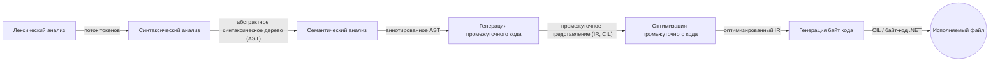

```mermaid
flowchart LR
    n1["Лексический анализ"] -- поток токенов --> n2["Синтаксический анализ"]
    n2 -- абстрактное синтаксическое дерево (AST) --> n3["Семантический анализ"]
    n3 -- аннотированное AST --> n4["Генерация промежуточного кода"]
    n4 -- промежуточное представление (IR, CIL) --> n5["Оптимизация промежуточного кода"]
    n5 -- оптимизированный IR --> n6["Генерация байт кода"]
    n6 -- "CIL / байт-код .NET" --> n7(("Исполняемый файл"))
```